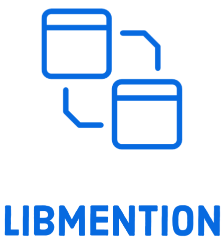

[](https://hexdocs.pm/libmention/readme.html)

<!-- MDOC !-->

A [Webmention](https://www.w3.org/TR/webmention/) implementation for Elixir

[Read the documentation](https://hexdocs.pm/libmention/Libmention.html)

## Goals
* [x] [Send](https://www.w3.org/TR/webmention/#sending-webmentions) WebMentions
* [ ] [Receive](https://www.w3.org/TR/webmention/#receiving-webmentions) Webmentions (in progress)
* [x] Configurable storage, defaulting to `ets`
* [ ] Easy local development and management of WebMentions including:
  * [ ] Accept
  * [ ] Decline
  * [ ] Verify
  * [ ] Block
  * [x] See Sent

## Usage
All aspects of the library can be used piecemeal or as a supervised system.

### Sending
When using piecemeal, the functions worth exploring are in `Libmention.Outgoing`:
* `Libmention.Outgoing.parse/1` is used to parse an html document for all unique links. The idea here is to pass in the body of your post/note/comment and determine which urls may need to have a webmention sent.
* `Libmention.Outgoing.discover/2` takes a link, sends a discovery and determines if webmention is supported at that specific link
* `Libmention.Outgoing.send/4` sends a webmention

When using as a supervised system, add the `Libmention.Supervisor` to your supervision tree and configure it for sending.
```elixir
config = [
  outgoing: [
    storage: Libmention.EtsStorage
  ]
]
children = [
  ...,
  {Libmention.Supervisor, config}
]
```
> See `Libmention.Supervisor` for a full list of options

Then to send webmentions for a page or content,

```elixir
Libmention.Supervisor.send(url, html)
```

When the process is done, 

### Receiving

<!-- MDOC !-->

## Installation

Add `libmention` to your list of dependencies in `mix.exs`:

```elixir
def deps do
  [
    {:libmention, "~> 0.1.2"}
  ]
end
```
